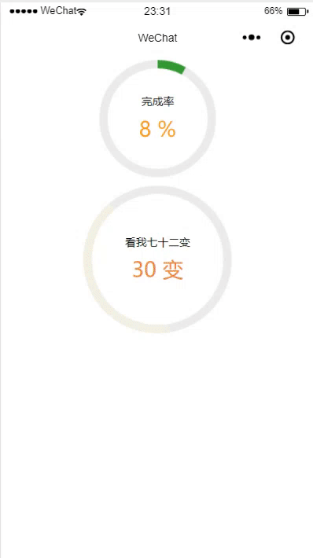
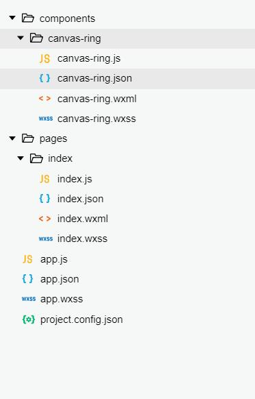

## 微信小程序自定义组件canvas-ring环形进度条  

### 效果图  
  

### 使用方法  
##### 在根目录创建`components`名字的文件夹，将`canvas-ring`文件添加进去  
*目录结构*  
  

##### index.json  
```js
{
  "usingComponents": {
    "canvas-ring": "/components/canvas-ring/canvas-ring"
  }
}
```  

##### index.wxml  
```js
<canvas-ring id="canvasRing" value="{{c_val}}"></canvas-ring>
```  

##### index.js  
```js
onReady: function() {
    var that = this;
    that.canvasRing = that.selectComponent("#canvasRing");
    that.canvasRing.showCanvasRing();
},
```  

### 属性介绍  
| 属性名字 | 类型 | 默认值 | 说明 |
| :------ | :------ | :------ | :------ |
| canvasWidth | Number | 屏幕宽度的0.4倍 | 画布宽度 |
| title | String | "完成率" | 标题，设置为""为空 |
| value | Number | 45 | 当前的值 |
| maxValue | Number | 100 | 最大值 |
| minValue | Number | 0 | 最小值 |
| suffix | null | "%" | 当前值的后缀名,任何类型 |
| lineWidth | Number | 10 | 线条宽度 |
| lineColor | String | "#393" | 线条颜色 |
| valueColor | String | "#ff9c07" | 当前值的颜色 |
| startDegree | Number | 0 | 从什么角度开始 0~360之间 （12点方向为0,18点方向为180,0点方向为360） |

